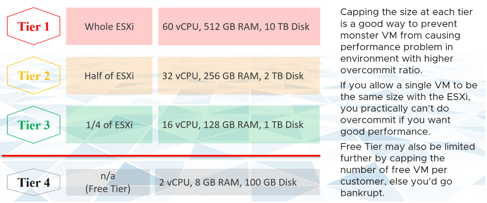

对于 IaaS 或 DaaS，容量管理早在部署硬件之前就开始了。它从一个商业计划开始，它决定了将提供什么级别的服务。每个服务等级（例如金、银、铜）都因服务质量而有所不同。这通常包括可用性（例如，黄金级为 99.99% 的正常运行时间，白银级为 99.95% 的正常运行时间）、性能和安全性/合规性。这在之前的 [SLA](/operations-management/chapter-1-overview/1.1.7-service-level-agreement/) 中有介绍。

上表是通用指南。作为 IT 管理计划的一部分，您可以帮助他们定义和决定每个服务等级。此计划会话需要供应商输入，因为您希望优化成本。使用供应商折扣和许可模式来补充计划，而不是规定计划。

在计划会议结束时，您可能会得到这样的结果。

在此示例中，IT 管理部门决定仅提供两种业务产品：

- **白银**：33% 的折扣和 2% 的性能损失
- **铜奖**：67% 的折扣和 5% 的性能损失

[Kim Ramirez](https://www.linkedin.com/in/kimkiser1/) 建议，从定价心理学的角度来看，提供黄金可能是有意义的，期望没有人会购买它，它只会起到银色看起来很划算。这也解决了一个潜在的困惑，如果客户只看到银牌和铜牌优惠，他们会想知道金牌在哪里。

质量会产生成本，而成本反过来又会影响价格。 Gold VM 的每 vCPU 和每 GB 内存的价格更高，因为它具有更高的服务质量。需要规划合适的定价模型。 Silver Tier 上 16 个 vCPU VM 的成本确实比 Gold Tier 上 1 个 vCPU VM 的成本高。这是您想要驱动的行为。合适的层级，合适的尺寸。

如果您希望您的客户提前调整大小，那么 64 个 vCPU 虚拟机的价格需要是 1 个 vCPU 虚拟机价格的 64 倍以上。如果定价模型是一条简单的直线，则不会有小规模的动机，也不会因过度提供而受到惩罚。您最终将在生产中强制调整规模，这是一个昂贵且耗时的过程。

参考 [成本管理](/operations-management/chapter-5-cost-management/) 的定价示例，因为成本和价格是相辅相成的。

因为你过度使用，所以你冒着争用的风险。要将其最小化，一种方法是控制 VM 的大小。您希望避免庞大的虚拟机支配过度使用的 ESXi 主机。下表提供了与每个服务类别关联的大小限制示例。

相比之下，EC2 VM 的 [AWS 免费套餐](https://aws.amazon.com/free/) 只有 1-2 个 vCPU、1 GB RAM，因为它基于 t2.micro 和 t3.micro。