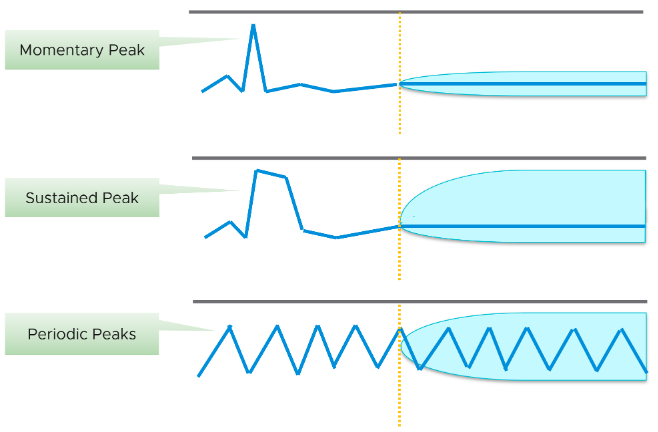
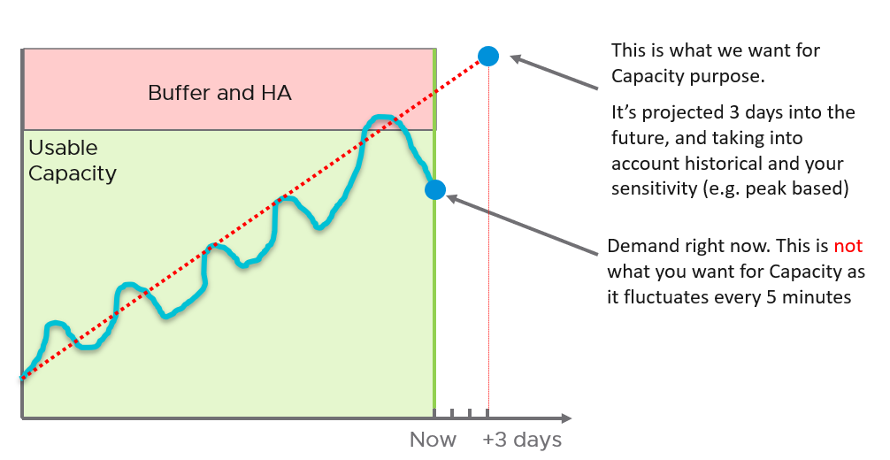
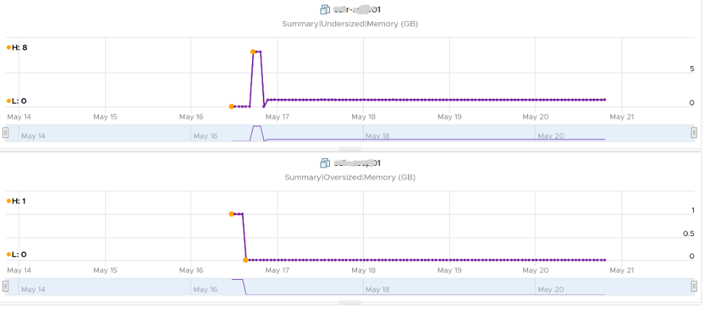

The accuracy of the prediction depends on the amount of data and the length of the cycle. A workload with quarter end peak will naturally need at least 6 months for it to be accurate. If there is enough data, vRealize Operations will consider 6+ months worth of data. While it gives extra weight to recent data, if there is a sudden but short-lasting change, it may not be enough to impact the projection.

Momentary peaks that are short lived and one-off should not impact capacity planning so the impact may not be noticeable in the projection.

Sustained peaks last for a longer time and do impact projections.  If the peak is not periodic, the impact on the projection lessens over time due to exponential decay.

Periodic peaks exhibit cyclical patterns or waves. For example hourly, daily, weekly, monthly, last day of the month, etc. There can be multiple overlapping cyclical patterns, which will also be detected. While you should not make capacity decision based on just a few days of data, you do need the 5-minute granularity as input. A 5-minute peak that gets repeated every hours should be considered.

If you do not have 3 months and just need an overall sizing, consider using the 97th percentile value. Why 97th percentile? It's based on standard deviation principle. Two [Standard Deviation](https://en.wikipedia.org/wiki/Standard_deviation) away from the midpoint equals to 95%, and 3 Standard Deviation = 99.7%. 97th percentile hence provides a good balance between 2 SD and 3 SD. By and large, it captures just the right amount of peak and outlier.

**Capacity Remaining (%)** uses a projected value, 3 days into the future, hence it might differ with currently used capacity. As it’s future value, there is confidence band. You can choose between aggressive (based on the upper limit of the band) and conservative (based on the actual trajectory). On the other hand, if the present utilization exceeds the usable capacity, vRealize Operations sets the value of Capacity Remaining to 0%. 

Take note that CPU Capacity Remaining (%) and Memory Capacity Remaining (%) appear in the policy as enabled but cannot be used. That’s an internal metric which should have been hidden.

**Time Remaining** measures the number of days before capacity runs out. The projection is up to 1 year, with time remaining above 1 year is simply shown as 1 year. The conservative is based on the upper bound of the capacity remaining projection.

**VM Remaining** measures the number VM with average size that can fit into the cluster. The average VM size calculated automatically, so it varies across time and across clusters. VM Remaining at vSphere Data Center and vCenter levels are simply the sum of the children clusters. There is no calculation of average VM size at these levels, so you like have mixed sizes. Also, the VM Remaining value does not fall below 0. It’s possible for a data center to show positive VM Remaining value even though there is short fall in one of its member clusters.

**Recommended Size** is based on the highest projected value within the planning window, not the value of projection at the end of the window. By default, the planning window is 60 days for VM. This comes from 30 days provisioning buffer + 30 days (the default threshold for Time Remaining to be in the green zone, as shown in the screenshot).

If the VM usage is increasing over time, the projection will likely follow, and you will get a number that exists 60 days into the future. 

If your operations is able to make frequent adjustment, change the Time Remaining window to 0. This will give 30 days adjustment period.

Take note that the recommended size for Memory is rounded to the nearest GB. 

