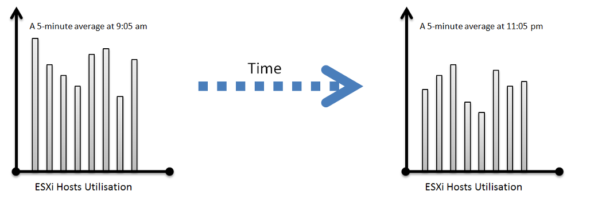

One common requirement we get from customers is the need to size for peak. We often see mistakes in defining what peak actually is, as by default, ***averages*** get in the way.

So let's elaborate on peaks.

How do you define peak utilization or contention without being overly conservative or aggressive?

There are two dimensions of peaks. You can measure them across time or members of the group.

Let's take a cluster with 8 ESXi hosts as an example. The following chart shows the 8 ESXi utilizations.

What's the cluster peak utilization on that day?

The problem with this question is there are 1440 minutes in a day, so each ESXi Host has at least 288 counters (based on the 5-minute reporting period). So this cluster has 288 x 8 = 2304 metrics on that day. A true peak has to be the highest metric among these 2304 metrics.

To get this true peak, you need to measure across members of the group. For each sample data, take the utilization from the host with the highest utilization. In our cluster example, at 9:05 am, host number 1 has the highest utilization among all hosts. Let's say it hit 99%. We then take it that the cluster ***peak*** utilization at 9:05 am is also 99%.

You repeat this process for each sample period (e.g. 9:10 am, 9:15 am). You may get different hosts at different times. You will not know which host provides the peak value as that varies from time to time.

What's the problem of this true peak?

Yup, it might be too sensitive. All it takes is 1 number out of 2304 metrics. If you want to ignore the outlier, you need to use percentile. For example, if you do 99th percentile, it will remove the highest ~23 datapoints.

Take note that the most common approach is to take the _average_ utilization among all the 8 ESXi hosts in the cluster. So you lose the true peak, as each data point becomes an average. For the cluster to hit 80% average utilization, at least 1 ESXi host must have hit over 80%. That means you can't rule out the possibility that one host might hit near 100%.

The same logic applies to a VM. If a VM with 64 vCPUs hits 90% utilization, some cores probably hit 100%. This method results in under-reporting as it takes an average of the "members" at any given moment, then take the peak across time (e.g. last 24 hours).

This "averaging issue" exists basically everywhere in monitoring, as it's the default technique when rolling up. For a more in-depth reading, look at [this](https://bravenewgeek.com/everything-you-know-about-latency-is-wrong/) analysis by [Tyler Treat](https://bravenewgeek.com/about-me/).