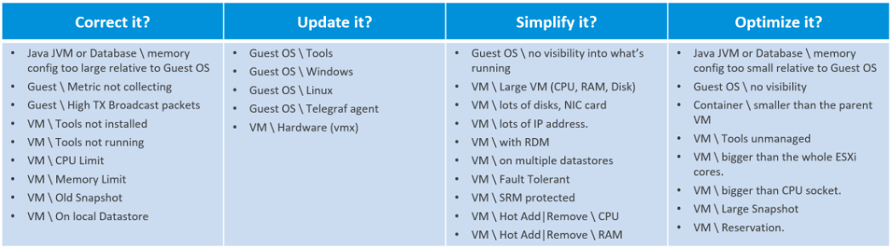

您需要管理數以千計的設置以確保安全性、性能和可用性。為確保首先跟踪和解決關鍵問題，請考慮對它們進行優先排序。 vRealize Operations 8.2 使用 4 步檢查，從最緊急的開始。

#### 步 1

解決不正確、不安全、不符合公司標准或違反最佳實踐的設置。你應該適當地糾正它們。

這通常是最緊急的步驟。

#### 步 2

設置是正確的，但在舊版本上。很難跟上所有供應商版本，因此您應該優先考慮最舊的版本，尤其是那些不再受支持的版本。

典型的 SDDC 或 EUC 架構跨越許多組件。雖然每個都可以運行最新版本，但它們可能不兼容或不支持。

#### 步 3

這些設置是正確且最新的，但它們會使您的 IaaS 操作複雜化。由於您不太可能將它們全部消除，因此應制定將它們最小化的策略作為簡化操作的一部分。

#### 步 4

最後一步是關於成本和容量，因為沒有問題。您希望最大限度地利用資源，同時最大限度地降低成本。這是一個平衡的行為！

-----

請注意，每個客戶都以獨特的方式經營他們的業務。每一個操作都像一個人的指紋。因此，適合其他客戶的不一定適合您。即使在相同的環境中，適合開發環境的不一定適合生產。

下表列出了一些可能性。將它們用作輸入以根據您的需要自定義配置儀表板。它提供了在 IaaS 消費者層中檢查內容的示例。該層由 VM 和在 VM 內運行的所有內容組成，例如進程、應用程序、來賓操作系統和容器。

下表描述了 IaaS 提供商層。這一層由軟件和硬件基礎設施組成，例如 Telegraf、ESXi、計算集群、數據存儲和數據存儲集群、資源池、分佈式虛擬交換機和端口組、vSAN、NSX 和硬件。

