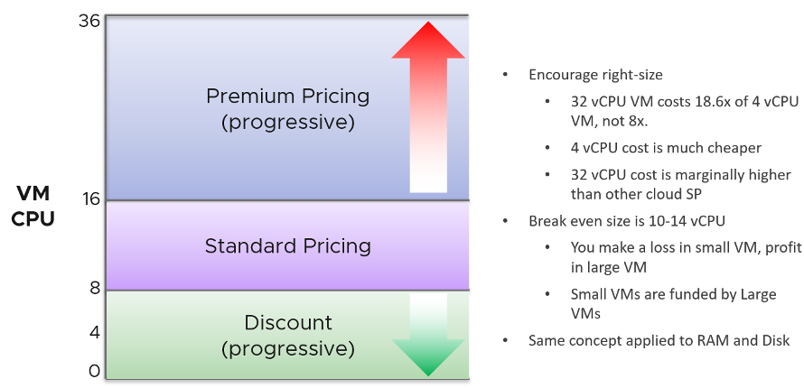
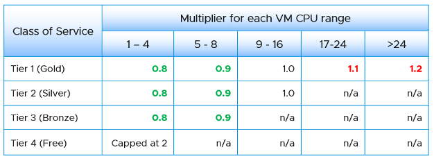
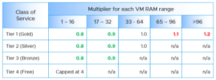
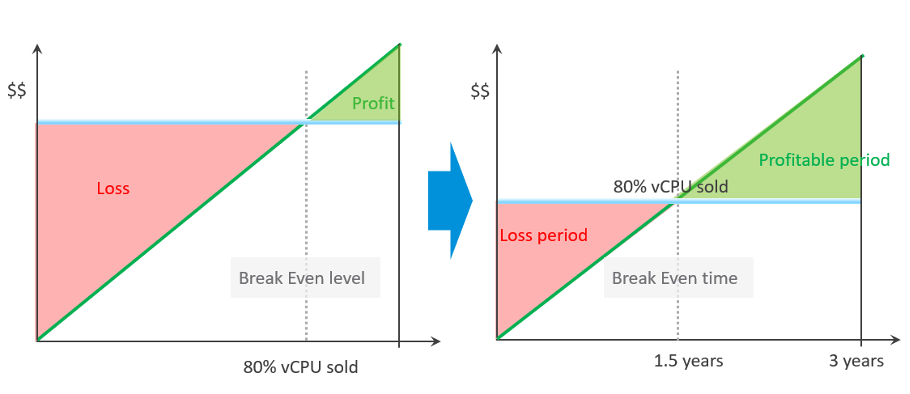

Price is simply Cost adjusted with margin, discount and penalty. Use price to drive the right behaviour and encourage adoption.

As an internal cloud provider, what business problems do you want to solve with pricing?

Oversized VM is a problem that is best solved before the VM hits production. So design your pricing model to encourage the right size from the beginning. Right size, right from the start. Create a progressive pricing and apply discounts for smaller VM sizes. The following diagram shows an example of tiered pricing. Premium pricing is applied on VMs larger than 16 vCPU, while discounted pricing is applied on VMs smaller than 8 vCPU.

How do you apply the progressive pricing above into different Classes of Service? How much of a premium should you put on the big VM? How deep should you discount the small VM? The multiplier effect (the progressive tax) cannot be too high because public cloud does not have such tax. They follow a linear pricing. If you use a high multiplier, your price will be too high, or you will absorb a deep loss.

The following table provides an example of multiplier.

We apply the same principle for RAM.

Keep your pricing model simple. The more complex your bill, the more you have to explain. The following table provides a suggestion of what to charge and what to bundle. Bundling means you include it in your overall cost but not charge explicitly for it. You are certainly trading off accuracy with simplicity.

Overly simplified pricing could be unfair to customers, but that’s common in other industries. Take the airline industry, where my favourite airline is Singapore Airlines. I notice they have at least 4 generations of planes. The new plane is more efficient, costs less to operate and is more enjoyable to customers. On the other hand, if you take into account depreciation, the old plane is already fully depreciated. And yet, the price is the same across all generations.

## Break Even

When planning your pricing, think of the time required to reach the breakeven point. That period should leave enough time for you recoup your expenses. It should be way before the depreciation ends.

The break-even point depends on the break-even level. You may not be able to fully sell all the resources at the end. So if your plan is based on 80% sold, then the price of this 80% has to be able to cover the cost of everything.

