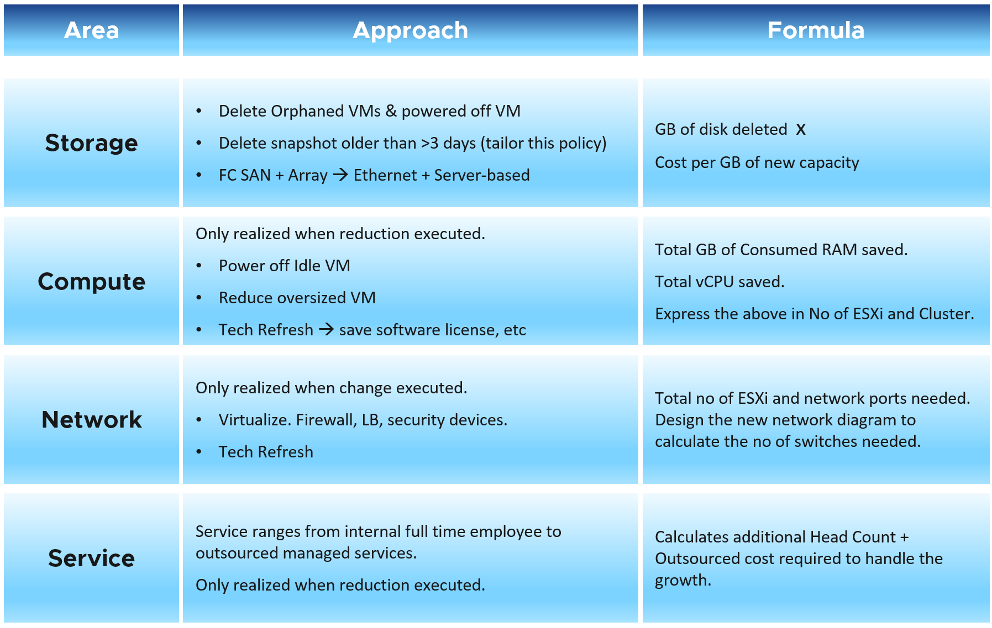
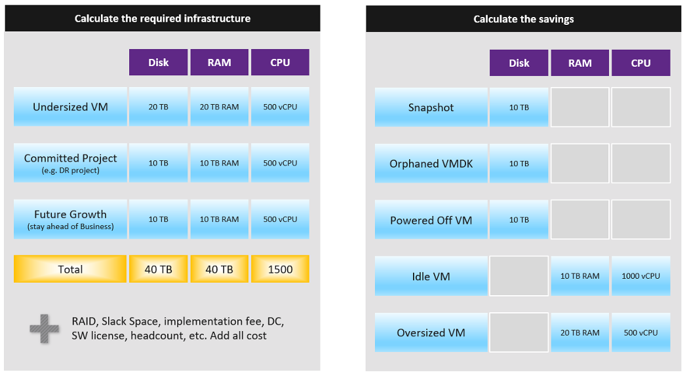

计算单位成本很重要，尽管它实际上并不存在。当您购买集群时，您没有为每 GHz CPU 支付 1 美元。您为整个设备（包括安装）支付了 100,000 美元。 1 美元仅用于计算目的，因此您不会以亏损告终。

每个 VM 的单位成本取决于 过度承诺 比率, 因为硬件成本是一样的. 如果集群 A 有 2x 过度承诺 比率, 那么在相同的其他条件下，每个 VM 的成本要便宜 2 倍。

过度承诺比率是您解释更高价格的方式，因此必须提前向您的客户披露。

单位成本必须与 VM 相关联，而不是与 ESXi 相关联。它以 vCPU 表示，而不是以物理内核或 GHz 表示。您计划打包多少个 vCPU 决定了每个 vCPU 的成本。

单位成本取决于硬件和软件。由于更大的硬件，新集群的成本应该更低。

在相同的服务水平内，单价应保持不变。 回到航空业的例子，价格不取决于飞机的类型。

## 节约成本

从财务的角度来看，只有推迟新采购才能实现真正的成本节约。你不能节省你已经花费的，会计明智的。成本节约实际上是成本避免。

我们举一个简单的例子：

- 3 年前，您在超融合基础设施 (HCI) 解决方案上花费了 200 万美元。
- 已经很好用了，现在剩余容量为0%，需要购买新的HCI。这只会花费您 100 万美元，因为 HCI 解决方案的成本在过去 3 年中下降了一半。
- 通过勤奋而艰巨的回收过程，您设法释放了产能。因此，您不需要花费 100 万美元。您可以将此购买推迟到下一个财政年度。
- 您从这次填海中节省了多少：200 万美元或 100 万美元？

在会计方面，它只有100万美元。尽管三年前 HCI 花费了您 200 万美元，但具有相同容量的全新设备只需花费您 100 万美元。在会计规则中，您不应该混合来自不同日期的数字，更不用说来自不同会计年度的数字。折旧在这里不相关，因为成本基于重置成本。

一百万美元当然是 ***估计***。避免或花费的实际成本取决于供应商的报价和您的谈判技巧。请注意，实际成本远高于 HCI 成本。额外的成本可能会超过硬件成本。您需要包括所有加载成本，例如数据中心设施、实施服务、备份存储、管理服务、软件许可、管理等。

仅开垦就可以 ***不是*** 降低成本. 删除笔记本中的文件可以节省多少钱？

正确的。零。

只有当它帮助您推迟购买新硬盘时，您才能真正节省成本。

服务怎么样？我们喜欢将提高生产力称为成本节约。尽管这提供了商业价值，但这并不是一项硬成本节约。这是一种没有会计价值的软收入。只有在推迟购买额外资源/员工的需要，或管理服务合同的价值下降时，才会发生硬性储蓄。

您可以通过关闭硬件电源来节省电力和冷却。

对于拥有大量基础设施足迹的大型组织，技术更新是降低成本的好方法。从 100 个机架减少到 50 个机架肯定会降低资本和运营成本。

IT 需要领先于业务。在计算成本节省时，包括承诺的项目和未来的增长。您还应该考虑太小的 VM，因为应用程序团队可能需要扩大它们。

计算 CPU、RAM 和磁盘。如果可能，还包括网络。计算起来比较困难，因为它本质上只是互连。对于这三个 IaaS 资源中的每一个，计算需求和恢复。对于要求，不要忘记包括所有成本。当 VM 需要 100 GB 时，它会转化为更多，因为您将 DR、备份、快照等考虑在内。

下表提供了一个示例。

您需要为每个物理位置准备上表。仅仅因为您在新加坡拥有 10 TB 的 RAM 并不意味着亚美尼亚虚拟机可以使用它。

## 优化成本

上述练习将有助于优化成本。当然，还有其他方法可以优化成本，因为成本涵盖的不仅仅是容量。它涵盖了人员、流程和架构。您可以通过提高流程效率来降低成本，通常是通过业务流程再造练习。您可以通过自动化提高流程效率来降低成本。例如。使用批准工作流删除关闭的 VM。

下表总结了您可以执行以优化成本的活动。

小型集群具有更高的 HA 开销，因此您可以通过整合它们来优化成本。

复杂性是有代价的，但很难量化。例如，人为错误可能代价高昂，但您如何对其进行量化？

请注意，标准化将降低复杂性。但这也意味着配置不够灵活，会增加成本。

简化操作，例如不在同一集群中混合具有不同服务类别的 VM，将降低复杂性。但这也以更大的基础设施为代价。 T 恤尺寸也是如此。