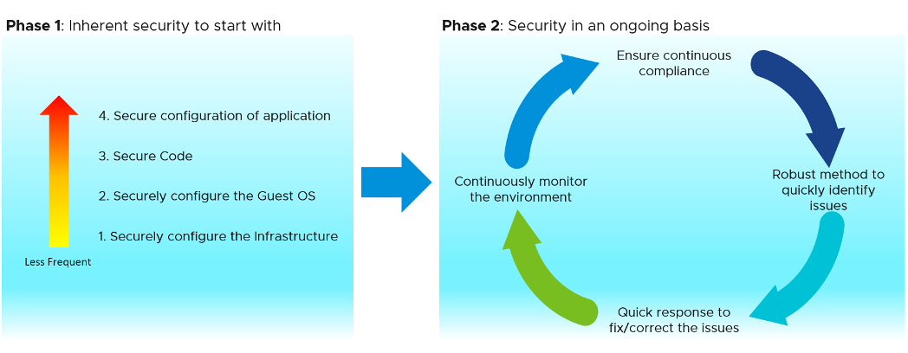

Security in an organization or in a data center specifically is an approach which can be divided into two main areas.

- Secure configuration of the components
- Security practices or process in place

The first point is all about making changes in the environment or products and securely configuring them. For example, if a program expects an input from users, then use proper input validation to protect against unwanted inputs. Another example is using different roles and then [Role Based Access Control (RBAC)](https://en.wikipedia.org/wiki/Role-based_access_control) to ensure only authorized persons get proper levels of access to an environment.

The second point is all about process. For example, if you want to make changes to a server, proper approval channel needs to be followed and the changes needs to be documented. The purpose of that is to avoid any unnecessary changes and to track who did what. Typically, organization would have a proper “Change Management” process in place.

Here we are covering the first area “secure configuration of the components”. Within this area there are two different phases. They are detailed below.

The first phase is where the initial configuration is done. This includes securely configuring the data center environment (less frequent task) to configuring security for the individual applications (more frequent task). The second phase is all about maintaining and ensuring security on an ongoing basis.