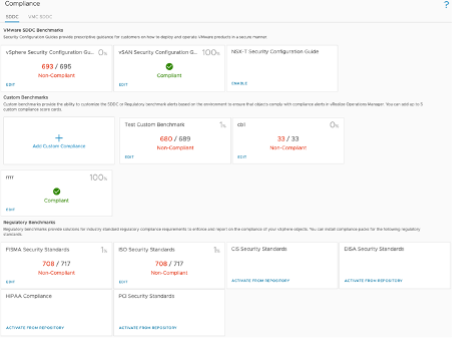
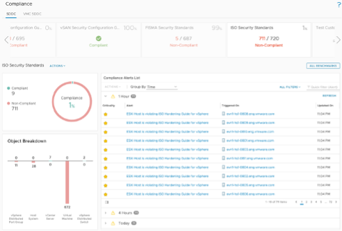
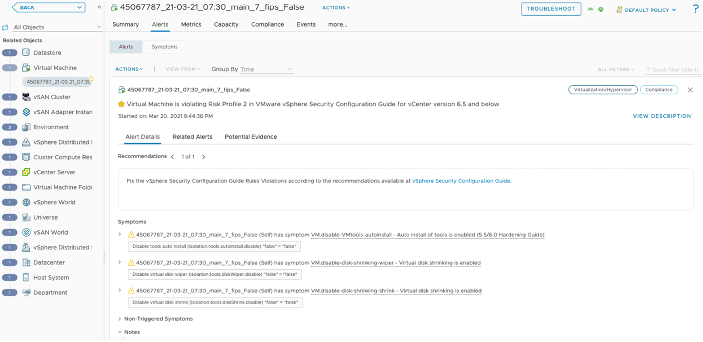

As depicted below, the default compliance page shows at a glance compliance status of the environment against different policies. The “Compliance cards” show the status of the environment against a compliance benchmark.

To check further details of a topic, click on card for that topic. This gives us the detailed view of the environment.

Note the links under “Compliance Alerts List”. This gives us the details of the non-compliance. Clicking on that link will take us to the particular alert details.

Also note, for any selected object we can check the compliance related to that object from “Compliance” tab.

Based on the reports we need to further correct those issues and further run compliance.