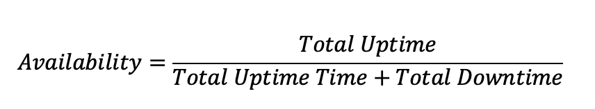

The simplest representation of availability is a ratio of the value of the uptime of a system to the aggregate of the values of up and down time during the observation window.

Let’s take an example. In a year (defined as 365.25 days) a solution has a single downtime lasting 24 hours on a busy working day.

So, the availability can be calculated as:

Another equation for availability is a ratio of the Mean Time Between Failure (MTBF) and Mean Time To Repair (MTTR), or:

The industry practice is to call out availability in terms of “nines”. For example, 99% availability is two nines, 99.99% is termed as four nines. In our example above, the system delivered 99.73% even though it was down for entire day!