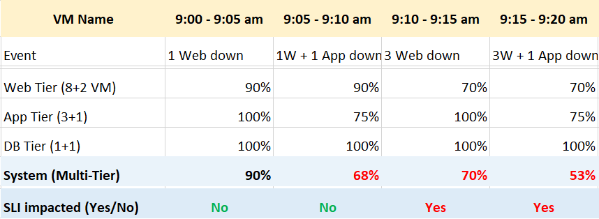

Can you spot the limitation of the above calculation?

Hint: it measures in 1 month.

How many minutes of downtime is allowed with 99.9% in a typical month?

About 43 minutes, which is a long time if it happens during busy time. You can potentially lose a lot of business, not to mention customers unhappiness.

The problem with the above calculation is it calculates per month. It fails to account that there is a big difference between all components down at the same time vs different time. Review the following table, which records the uptime every 5 minutes.

The above system has 3 tiers: web, application and database.

The web tier is sized with 8 VM, plus 2 additional VM added for resilience. The application tier is designed with 3+1 server farm. The database uses active/passive design.

Let's step through the time to show how difference scenarios impact availability.

#### 9:00 – 9:05 am

- 1 of the web server is down. All other servers are up. For simplicity, we assume the downtime is exactly 300 seconds.
- The uptime of the web tier become 9/10 = 90%.
- Overall, the system uptime is 90%.
- SLA is not impacted as the web tier has been designed to handle 2 failures.
- While SLA not impacted, it's important to record the fact that the uptime is not perfect.

#### 9:05 – 9:10 am

- 1 web server + 1 application server is down. All other servers are up.
- The uptime of the web tier become 9/10 = 90%.
- The uptime of the application tier become 3/4 = 75%.
- Overall, the system uptime is 68%.
- SLA is not impacted, as both tiers do not breached their threshold.

#### 9:10 – 9:15 am

- 3 web servers are down. All other servers are up. The uptime of the web tier become 7/10 = 70%.
- Overall, the system uptime is 70%. This is higher than the 68% previously, but this time the SLA is impacted as the web tier is not designed to handle 3 failures.
- From here you can see that uptime and SLA can differ. - The former is absolute and technical, while SLA is relative to design and eventually business contract.

#### 9:15 – 9:20 am

- As previous, but 1 application server is down. It's important to reflect this deteriotation, hence the uptime drops from 70% -> 53%.
- SLA does not care about it, as it focuses on fail or not. It's binary within that 5 minutes.

We can now continue the timeline for entire month. I'm modifying the example a bit to drive the point that SLA and reality can differ.

From 9:00 am – 9:30 am, the system never has 100% uptime. For the rest of the month, it has a perfect 100% uptime.

SLA is only impacted for 5 minutes. All other downtime do not impact SLA because the system has been designed to handle the failure or it is a scheduled downtime.

SLA is based on calendar month. Using February 2021 as the example, there are 28 days. This translates into 8064 counts of 5-minute.

#### SLA

- (8064 – 1) / 8064 = 99.988%
- If the SLA is 99.95, then you pass for the month of February 2021.

#### Reality

- Average of (34% + 3.75% + 0 + 0% + 34% + 34% + 100% + 100% + 100% + ….)
- Yes, we simply average all the 8064 numbers that make up February 2021.
- Result is 99.939%

The gap between reality and SLA provides valuable input.